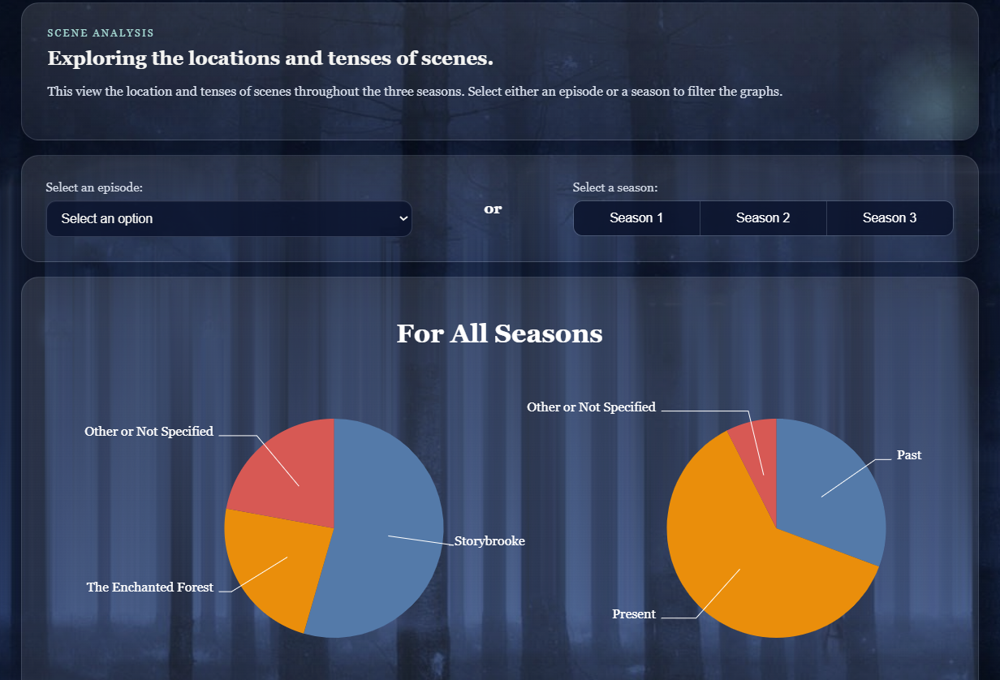
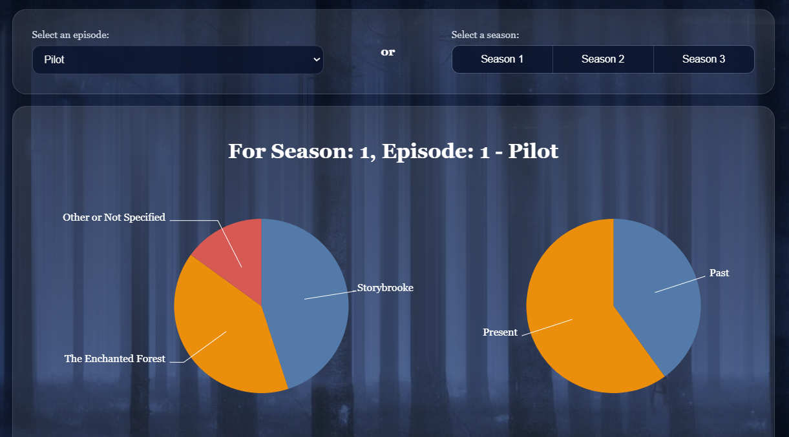
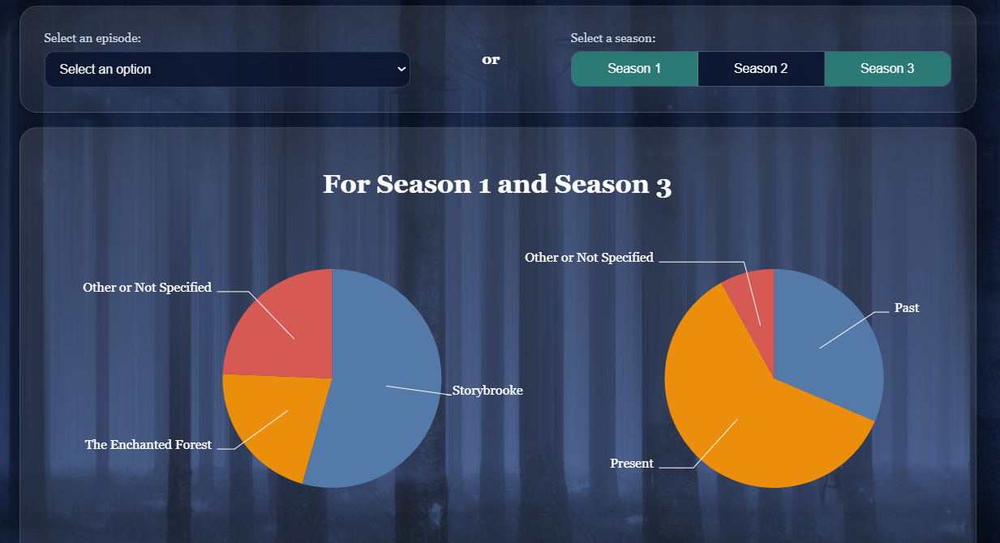
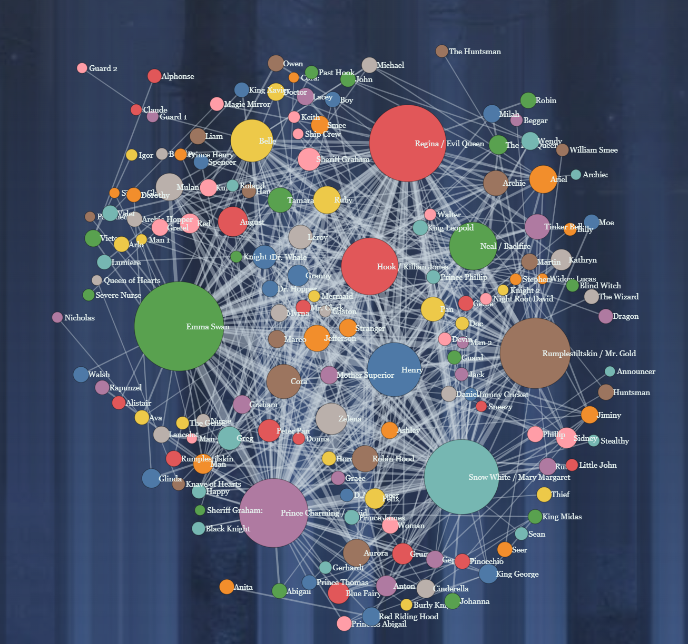
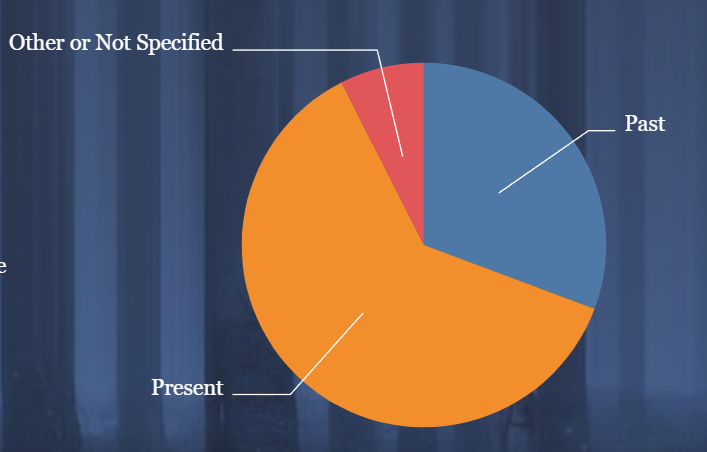
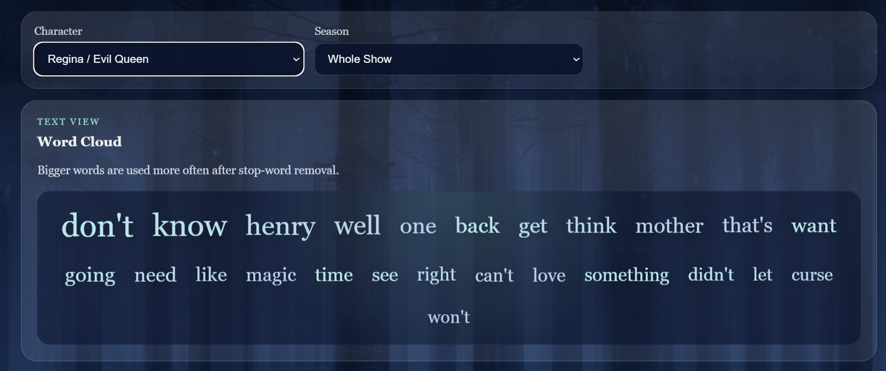

# Project Name

**Team Members:** Ikran Warsame, Kelly Deal, Faith Rider, Fareena Khan

[Live Application](https://kellannd.github.io/tv-time/index.html)

---

## Motivation

Once Upon a Time has a huge cast of fairy-tale characters and a lot going on across the show. With so many overlapping storylines, it can be hard to tell who actually drives the show, how the focus shifts over time, and how characters connect to each other.

We built this app to make those patterns easier to see. We pulled the transcripts from the first 3 seasons (64 episodes total) and used them to explore things like:

- Which characters get the most lines, and when?
- What words and phrases are each character known for?
- Who talks to who, and how do those relationships change across seasons?
- How does the setting (Storybrooke, the Enchanted Forest, Neverland, etc.) shape the story?

---

## Data

Analyzed seasons 1-3, excluding season 1 episode Dreamy and season 3 episode Think Lovely Thoughts.

**Source:** [transcripts](https://onceuponatime.fandom.com/wiki/Category:Transcripts) from Fandom Wiki

### Data Collection & Processing

Used the Fandom Wiki API to pull data from the website. Documentation for API [here](https://onceuponatime.fandom.com/api.php)

Processing scripts:
- [`webscrape_main.py`](preprocessing-scripts/webscrape_main.py) — Grabbed the data from the website using the API, parsed the transcripts to get the scenes, characters, and lines, and output each transcript to a json file.
- [`webscrape_other.py`](preprocessing-scripts/webscrape_other.py) — A few of the transcripts were formatted slightly differently than the others. This does the same as the main webscraper, but is formatted slightly differently to account for those scripts.
- [`characters_alias.py`](preprocessing-scripts/characters_alias.py) — Many characters in this show have more than one name, and are referred to by different names (for example, both Mr. Gold and rumplestiltskin are referred to as seperate characters in the script but are the same person). This script parces the transcripts and combines the lines of characters that have different names.
- [`preprocess.py`](preprocessing-scripts/preprocess.py) — This script got a list of characters in each episode, characters in each scene, location of each scene, and whether the scene took place in the past or present.
- [`stemming.py`](preprocessing-scripts/stemming.py) — Stemmed the dialog.

Final processed data lives in [`data/`](data/).

---

## Visualization Components

### Level 4: Advanced Analysis
Main Advanced Analysis Page:
<br>

<br>
This is the main page for our advanced analysis, where we analyzed the locations and tenses for each scene in the show. Here, you are given the option of looking by episode or by season to see how many scenes took place in Storybrooke vs The Enchanted Forest vs other locations, and whether the scene took place in the past or present.

<br>

<br>
The graphs both update when an episode is selected.

<br>

<br>
You can select one or multiple seasons to update the graphs with.

### Design Sketches & Justifications

[fill in]

---

## Findings

The app allows exploration of character dialogue, interactions, and scene structure across the show.

#### Finding 1: Character Interactions

The network graph shows which characters interact most often. Central characters like Emma Swan, Regina, and Mr. Gold connect to many others, while smaller nodes represent characters who only interact with one or two others or appear briefly.



#### Finding 2: Time Distribution Across Seasons

Across seasons, a larger share of scenes takes place in the present compared to the past. Earlier episodes include more backstory, while later ones spend more time in present-day events.



#### Finding 3: Dialogue Patterns by Character

The word cloud highlights common words used by each character. For example, Regina’s dialogue includes words related to family, control, and magic, along with frequent references to Henry.



---

## Process

### Libraries & Tools

We mostly used D3 (v6) for the charts and plain HTML/CSS/JS for everything else. For the data side we used Python with `requests` and `BeautifulSoup` to scrape the transcripts off the Once Upon a Time Fandom wiki, and `nltk` (PorterStemmer) to stem the dialogue. Everything gets saved as JSON for the front end to read.

### Code Structure

```
tv-time/
├── *.html                      # one page per level (Overview, Dialogue, Interactions, Advanced)
├── css/                        # styles
├── js/                         # D3 + the per-level visualization code
├── data/                       # processed JSON the front end reads
├── preprocessing-scripts/      # Python scripts we used to scrape and clean the data
└── images/                     # backgrounds and character portraits
```

### Running Locally

It's all static, so you just need a local server:

```bash
git clone https://github.com/kellannd/tv-time
python3 -m http.server 8000
```

Then open <http://localhost:8000> in your browser.

The data is already in `data/`, so you don't need to do anything else to run the app. The scripts in `preprocessing-scripts/` are how we built that data in the first place. They aren't really one big pipeline though since they have hardcoded paths and we ran them on whatever we needed at the time. If you want to mess with them you'll need:

```bash
pip install requests beautifulsoup4 nltk
```

**Live application:** <https://kellannd.github.io/tv-time/index.html>

---

## Demo Video

[fill in]

---

## Team Contributions

| Member | Components |
|--------|------------|
| Fareena | Dialogue Analysis, Documentation |
| Ikran | Show Overview, Data Analysis |
| Kelly | Scripting, Advanced Analysis, Data Retrieval and Analysis |
| Faith | Character Interactions |

mention who deployed the site
